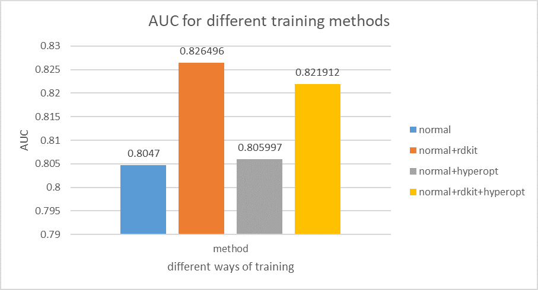
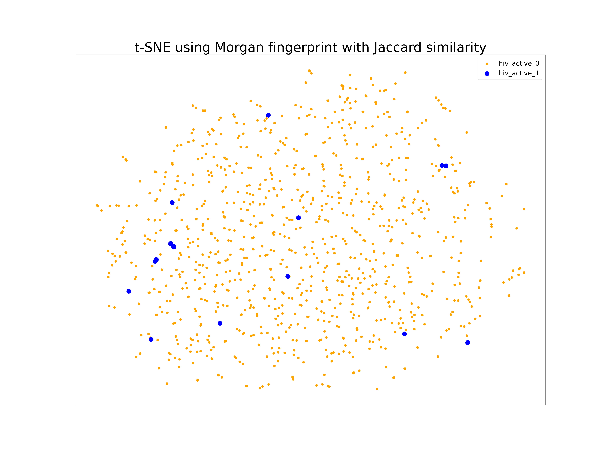
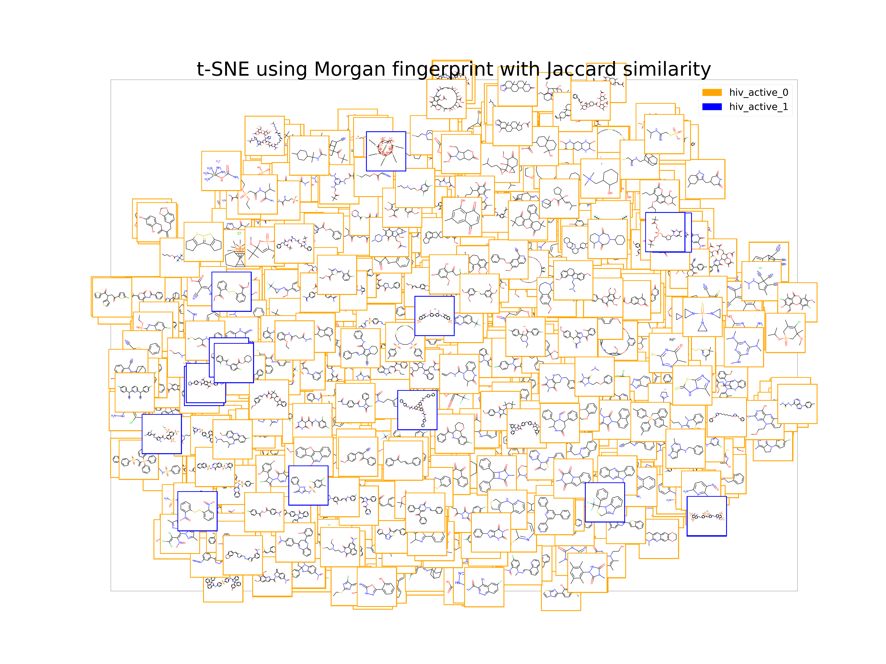

# CSCI596_final_proj
Ming Wang, Zhengxie Hu

## 1.Introduction
The goal of our project is to use Directed MPNN (D-MPNN) to predict molecular property which will accelerate the development of new chemical product. 

## 2.Dataset
- We used data from PoLyInfo polymer database maintained by Japan National Institute for Materials Science (NIMS).
- We registered an account and manually extracted the rheological property (melt viscosity) of common polymers and use it as input to the D-MPNN. We took the median value when there are multiple datapoints for the same polymer. 

- We tried to build a scraper (in polyinfo_scraper folder) with Scrapy, Splash and Requests library to automate the data acquisition. It is no longer feasible due to a recent update of PoLyInfo login system. We provided documentation on how to setup the Scrapy environment in scrapy_env_setup.md. 
- We used 4 chemical identifier conversion tool to try to convert as many chemical names to SMILES (Simplified molecular-input line-entry system) format as possible so that they can be used as input to the D-MPNN. However, no tool is able to find SMILES for most complex polymer names. The tools we used are PubChem Identifier Exchange Service (https://pubchem.ncbi.nlm.nih.gov/idexchange/idexchange.cgi), NIH Chemical Identifier Resolver API (see convert_name.py), ChemOffice20 Excel and JChem Excel (Product version 20.11.0, ChemAxon, Academic License). See processed_viscosity.csv for polymers we do find SMILES for.  

## 3.Objective
- Apply D-MPNN to this new dataset to predict some property of polymers.

paper link: [https://pubs.acs.org/doi/10.1021/acs.jcim.9b00237](https://pubs.acs.org/doi/10.1021/acs.jcim.9b00237)

- Visualize the result via t-SNE to reveal some relationships between polymers.

## 4.Result
### Property Prediction
- We applied D-MPNN to HIV dataset (10000 training samples), which is about the property of inhibition of HIV replication, and we tried four different training methods for this classification task. The AUC of different training methods is shown below:

### Visualization
- We visualized the final prediction of every molecule in test dataset (1000 samples) via t-SNE:

- We also visualized it with molecular representation:

